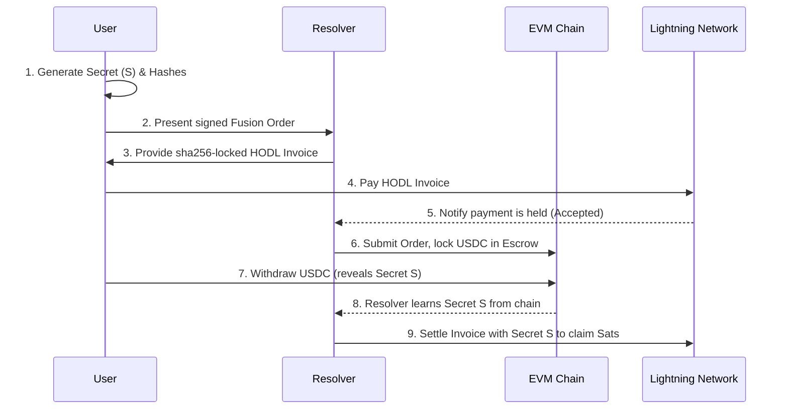
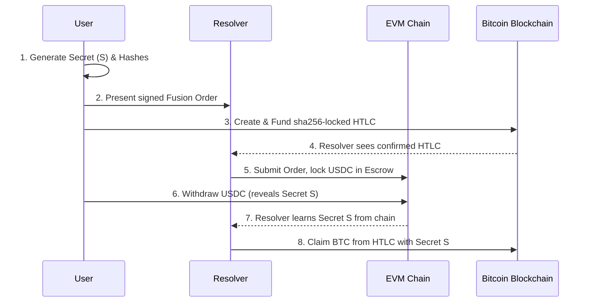
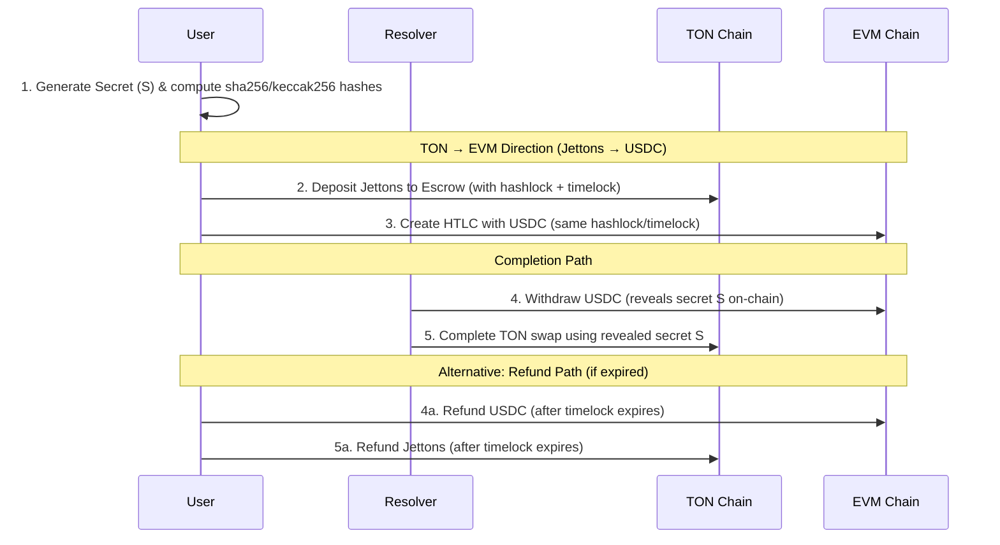

# Cross-Chain Atomic Swaps with 1inch Fusion

A comprehensive proof-of-concept for performing trust-minimized, cross-chain atomic swaps between EVM-based assets, native Bitcoin assets (both on-chain and via Lightning Network), and TON blockchain assets.

The core EVM-side logic is powered by the **1inch Fusion SDK**, enabling users to sign sophisticated, hash-locked limit orders off-chain, which are then executed by a **Resolver** on the blockchain.

## 🔗 Core Concept: The Atomic Swap

Atomic swaps are smart contract mechanisms that enable cryptocurrency exchanges between different blockchains without trusted third parties. The "atomicity" guarantees an "all-or-nothing" operation: either both parties successfully receive their funds, or the entire transaction reverts with no loss of original assets (minus transaction fees).

This is achieved using **Hashed Time-Lock Contracts (HTLCs)**.

---

## 🚀 Getting Started

### Prerequisites
- Node.js (v18+)
- `pnpm` package manager (`npm install -g pnpm`)
- Docker
- [Polar](https://lightningpolar.com/) - Desktop application for local Lightning and Bitcoin test networks

### Installation

1. **Clone Repository**
   ```bash
   git clone https://github.com/unite-defi-fusion-extensions/cross-chain-resolver-example.git
   cd cross-chain-resolver-example
   ```

2. **Install Dependencies**
   ```bash
   pnpm install
   ```

3. **Configure Environment**
   ```bash
   cp .env.example .env
   ```

---

## ⚡ Bitcoin & Lightning Network Swaps

### Technical Note
> **Critical Detail:** Ethereum and 1inch SDK use `keccak256`, while Bitcoin and Lightning Network use `sha256`. The swap logic must correctly generate and use the appropriate hash for each chain from the same original secret.

### Setup: Local Bitcoin & Lightning with Polar

1. **Download and install Polar** from [lightningpolar.com](https://lightningpolar.com/)
2. **Create Network**: Launch Polar → "Create Network" → Configure with **2 LND nodes** and **1 Bitcoin Core node**
3. **Start Network**: Click "Start Network" (downloads Docker images and starts nodes)
4. **Open Channel**: Create a balanced channel between LND1 and LND2

### Environment Configuration

Fill your `.env` file with Polar network credentials:

```dotenv
# LND Nodes
LND_RPC=https://127.0.0.1:8080
LND_MACAROON=0201036c6e...
LND_RPC2=https://127.0.0.1:8081
LND_MACAROON2=0201036c6e...

# Bitcoin Core RPC
BTC_RPC_HOST="http://127.0.0.1:18443"
BTC_RPC_USER="polaruser"
BTC_RPC_PASS="polarpass"
```

**Getting Credentials from Polar:**
- **LND Nodes**: Click node → "Connect" tab → Copy "REST Host" and "Admin Macaroon (Hex)"
- **Bitcoin Node**: Click bitcoind → "Connect" tab → Copy "RPC URL"

### Example 1: Lightning Network Swap
**Scenario:** User buys USDC with Lightning Sats  
**Test File:** `lightning.spec.ts`

#### Flow Diagram


#### Step-by-Step Process

1. **Secret Generation**: User generates secret (`S`) and corresponding `keccak256` and `sha256` hashes
2. **Order Signing**: User creates and signs off-chain 1inch Fusion order
3. **HODL Invoice**: Resolver provides HODL Invoice locked with `sha256` hash
4. **Payment Held**: User pays invoice → moves to `ACCEPTED` state (secret not yet revealed)
5. **On-Chain Execution**: Resolver submits signed order to EVM chain, locks USDC
6. **Claim & Reveal**: User withdraws USDC by submitting secret `S` on-chain (public reveal)
7. **Final Settlement**: Resolver uses learned secret to settle HODL invoice and claim Sats

### Example 2: On-Chain Bitcoin Swap
**Scenario:** User buys USDC with BTC  
**Test File:** `bitcoin.spec.ts`

#### Flow Diagram


#### Step-by-Step Process

1. **Secret Generation**: User generates secret (`S`) and its `keccak256`/`sha256` hashes
2. **Order Signing**: User creates and signs off-chain 1inch Fusion order
3. **Bitcoin HTLC**: User sends BTC to special script address locked with `sha256` hash
4. **On-Chain Execution**: Resolver sees confirmed HTLC → submits order to EVM chain, locks USDC
5. **Claim & Reveal**: User withdraws USDC by providing secret `S` (reveals on EVM chain)
6. **Final Claim**: Resolver uses learned secret to claim BTC from HTLC

### Running Bitcoin/Lightning Tests

```bash
# Lightning Network swap test
pnpm test -- lightning.spec.ts

# On-chain Bitcoin swap test
pnpm test -- bitcoin.spec.ts
```

---

## 🔷 TON Blockchain Swaps

### Technical Overview
TON swaps support bidirectional exchanges between **TON Jettons** and **EVM-based USDC** using custom HTLC contracts with synchronized hash locks and time locks.

> **Technical Note:** Both TON and EVM HTLC contracts use `sha256` hashing, ensuring hash compatibility across chains from the same original secret.

### Architecture Components

#### TON Side Features
- **Escrow Contract**: Custom smart contract deployed fresh for each test
- **Jetton System**: TON's token standard (similar to ERC-20)
- **Smart Contract Capabilities**:
  - **Random Context ID**: Unique 32-bit identifier for each deployment
  - **Hashlock Mapping**: Efficient swap lookup via dictionary storage
  - **Jetton Transfer Integration**: Handles incoming deposit notifications
  - **Timelock Safety**: Unix timestamp validation
  - **State Persistence**: All swap data stored with proper serialization

#### Operation Codes
- `OP_DEPOSIT_NOTIFICATION (0xdeadbeef)`: Handle jetton deposits
- `OP_COMPLETE_SWAP (0x87654321)`: Complete swap with secret reveal
- `OP_REFUND_SWAP (0xabcdef12)`: Refund expired swaps
- `OP_INITIALIZE (1)`: Initialize contract with jetton wallet

#### EVM Side Components
- **HashedTimelockERC20**: Standard HTLC contract for ERC-20 tokens
- **USDC Token**: Standard ERC-20 implementation
- **Anvil Fork**: Local Ethereum fork for testing

### Complete Swap Flow



### Key Implementation Features

#### 1. Fresh Contract Per Test
Each test deploys a new TON escrow contract with random salt, ensuring clean state and unique addresses.

#### 2. Synchronized Timelocks
Both chains use compatible timelock mechanisms:
- **TON**: Unix timestamp in seconds
- **EVM**: Unix timestamp in seconds (via block.timestamp)

#### 3. Dual-Path Support
- **Happy Path**: Secret reveal on EVM, completion on TON
- **Refund Path**: Timeout-based refunds on both chains

#### 4. Balance Verification
```typescript
// Jetton accounting
expect(userJettonBefore - userJettonAfter).toBeGreaterThanOrEqual(swapAmountJetton);
expect(contractJettonAfter - contractJettonBefore).toBeGreaterThanOrEqual(swapAmountJetton);

// USDC accounting  
expect(userUsdcBefore - userUsdcAfter).toBeGreaterThanOrEqual(amountUsdc);
expect(htlcBal).toBeGreaterThanOrEqual(amountUsdc);
```

### TON-Specific Implementation

#### Message Construction
```typescript
// Deposit Message (Jetton Transfer + Swap Payload)
const depositMessage = createTonSwapDepositMessage(
  amount, depositor, recipient, hashLock, timeLock, swapContractAddress
);

// Completion Message
const completeMessage = createTonCompleteSwapMessage(swapId, secret);

// Refund Message  
const refundMessage = createTonRefundSwapMessage(swapId);
```

#### Hash Lock Computation
```typescript
function tonHashLockFromSecret(secret: Uint8Array): bigint {
  const hashHex = crypto.createHash('sha256').update(Buffer.from(secret)).digest('hex');
  return BigInt('0x' + hashHex);
}
```

#### Contract State Management
```func
;; Persistent storage globals
global int   ctx_id;            // Random 32-bit contract identifier
global slice ctx_jetton_wallet; // Associated jetton wallet address
global int   ctx_swap_counter;  // Monotonic counter for swap IDs
global cell  ctx_swaps;         // Dictionary: swapId -> swap data
global cell  ctx_hashlock_map;  // Dictionary: hashlock -> swapId
global int   ctx_initialized;   // Initialization flag
```

**Key Contract Methods:**
- `get_swap_by_hashlock(int hashlock)`: Lookup swaps by hash lock
- `has_swap(int swapId)`: Check swap existence
- `get_id()`: Returns unique contract identifier
- `is_initialized()`: Validates contract readiness

### Environment Configuration for TON

Add TON testnet wallet mnemonics to your `.env`:

```dotenv
# TON Testnet Wallets (required for TON tests)
TON_USER_MNEMONIC="your twelve word mnemonic phrase here for user wallet"
TON_RESOLVER_MNEMONIC="your twelve word mnemonic phrase here for resolver wallet"
```

### Test Scenarios

The test suite covers:
1. **Swap Creation**: Deploy contracts, initialize, create swaps on both chains
2. **Completion Path**: Full atomic swap with secret reveal and completion
3. **Refund Path**: Timeout handling and refund mechanisms

### Running TON Tests

```bash
# Ensure TON_USER_MNEMONIC and TON_RESOLVER_MNEMONIC are set in .env
pnpm test-ton -- ton-eth.spec.ts
```

---

## 📋 Complete Environment Configuration

Your final `.env` file should include all necessary configurations:

```dotenv
SRC_CHAIN_RPC=https://eth.merkle.io
DST_CHAIN_RPC=wss://bsc-rpc.publicnode.com
SRC_CHAIN_CREATE_FORK=true
DST_CHAIN_CREATE_FORK=true

# LND POLAR
LND_RPC=https://127.0.0.1:8080
LND_MACAROON=0201036c6e...
LND_RPC2=https://127.0.0.1:8081
LND_MACAROON2=0201036c6e...

# Bitcoin Core (polar) RPC credentials
BTC_RPC_HOST="http://127.0.0.1:18443"
BTC_RPC_USER="polaruser"
BTC_RPC_PASS="polarpass"

# TON Testnet Wallets
TON_USER_MNEMONIC="abandon abandon abandon abandon abandon abandon abandon abandon abandon abandon abandon about"
TON_RESOLVER_MNEMONIC="abandon abandon abandon abandon abandon abandon abandon abandon abandon abandon abandon abandon"
```

---

## 🧪 Running All Tests

```bash
# Lightning Network swaps
pnpm test -- lightning.spec.ts

# On-chain Bitcoin swaps
pnpm test -- bitcoin.spec.ts

# TON blockchain swaps
pnpm test-ton -- ton-eth.spec.ts
```
